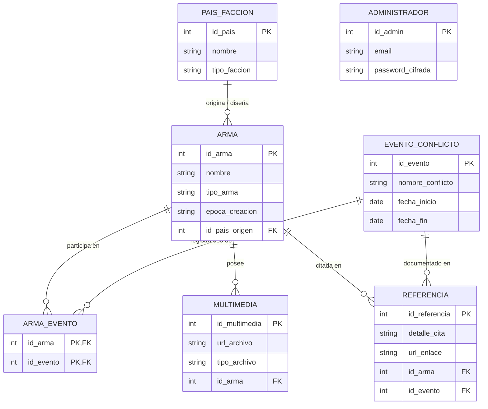

# Synapse-Militaria

> **Enciclopedia y API RESTful de Armamento, Facciones y Conflictos Históricos**  

---

## Descripción General

**Synapse-Militaria** es una plataforma y servicio backend orientado a la catalogación y consulta estructurada de armamento bélico histórico, los países y facciones que los crearon o emplearon, y los eventos o conflictos bélicos en los que tuvieron participación activa (Segunda Guerra Mundial, Guerra de Corea, Guerra de Vietnam, entre otros).

El proyecto implementa una arquitectura modular **MVC (Modelo - Vista - Controlador)** completamente asíncrona sobre **Node.js** y **Express**, respaldada por un motor relacional **SQLite** que permite consultar y correlacionar relaciones complejas (como asociaciones muchos a muchos entre armas y conflictos).

---

## Características

- **Arquitectura Asíncrona:** Operaciones no bloqueantes basadas en `Promises` y sintaxis moderna `async/await`.
- **Patrón MVC Desacoplado:** Separación rigurosa de responsabilidades entre capas de acceso a datos (`models`), lógica de negocio/respuesta (`controllers`) y enrutamiento del servidor (`app.js`).
- **Base de Datos Relacional Integrada:** Base de datos SQLite autocontenida y portable con soporte para relaciones uno a muchos y muchos a muchos (`N:M`).
- **API RESTful Estandarizada:** Respuestas uniformes en formato JSON con métricas de rendimiento y códigos de estado HTTP semánticos.

---

## Estructura del Proyecto

```text
Synapse-militaria/
├── backend/
│   ├── config/
│   │   └── database.js         # Configuración y conexión a SQLite
│   ├── controllers/
│   │   └── armaController.js   # Manejo de peticiones HTTP y respuestas REST
│   ├── models/
│   │   └── armaModel.js        # Consultas SQL encapsuladas en Promesas
│   └── app.js                  # Punto de entrada, configuración de Express y rutas
├── database/
│   └── synapse.db              # Base de datos SQLite (esquema y datos)
├── .gitignore                  # Exclusiones de Git (node_modules, entorno, etc.)
├── package.json                # Metadatos del proyecto, dependencias y scripts
└── README.md                   # Documentación principal del proyecto
```

---

## Tecnologías Utilizadas

- **Entorno de Ejecución:** [Node.js](https://nodejs.org/) (v18+)
- **Framework Web:** [Express.js](https://expressjs.com/) (v5.x)
- **Motor de Base de Datos:** [SQLite3](https://www.sqlite.org/) (Driver `sqlite3` v6.x)
- **Formato de Intercambio:** JSON

---

## Requisitos Previos

Antes de comenzar, asegúrate de tener instalado en tu sistema:

- **Node.js** (versión 18 o superior recomendada)
- **npm** (gestor de paquetes incluido con Node.js)
- **Git** (opcional, para clonar el repositorio)


## Documentación de la API

La API expone los siguientes endpoints RESTful:

### 1. Estado del Servidor
Verifica la conectividad y el estado operativo del backend.

- **Método:** `GET`
- **Ruta:** `/`
- **Respuesta Exitosa (200 OK):**
  ```json
  {
    "mensaje": "Bienvenido al Backend de Synapse-Militaria",
    "arquitectura": "Node.js + Express (Totalmente Asíncrono)",
    "estado": "Online"
  }
  ```

---

### 2. Catálogo General de Armas
Retorna el listado completo de armas registradas en la enciclopedia.

- **Método:** `GET`
- **Ruta:** `/api/armas`
- **Respuesta Exitosa (200 OK):**
  ```json
  {
    "success": true,
    "tiempo_respuesta": "Optimizado (< 1s)",
    "cantidad": 9,
    "data": [
      {
        "id_arma": 1,
        "nombre": "AK-47",
        "tipo_arma": "RIFLE",
        "epoca_creacion": "1949"
      },
      {
        "id_arma": 2,
        "nombre": "M1 GARAND",
        "tipo_arma": "RIFLE",
        "epoca_creacion": "1936"
      },
      {
        "id_arma": 3,
        "nombre": "KARABINER 98K",
        "tipo_arma": "RIFLE",
        "epoca_creacion": "1935"
      }
    ]
  }
  ```

---

### 3. Conflictos por Arma
Retorna los eventos y conflictos históricos en los que fue utilizada un arma específica, identificada por su ID.

- **Método:** `GET`
- **Ruta:** `/api/armas/:id/conflictos`
- **Parámetros de Ruta:**
  - `id` (número entero, requerido): Identificador único del arma (ej. `1` para AK-47).
- **Ejemplo de Solicitud:** `GET http://localhost:3000/api/armas/1/conflictos`
- **Respuesta Exitosa (200 OK):**
  ```json
  {
    "success": true,
    "data": [
      {
        "Arma": "AK-47",
        "Guerra": "Segunda Guerra Mundial",
        "fecha_inicio": "1939-09-01"
      },
      {
        "Arma": "AK-47",
        "Guerra": "Guerra de Corea",
        "fecha_inicio": "1950-06-25"
      },
      {
        "Arma": "AK-47",
        "Guerra": "Guerra de Vietnam",
        "fecha_inicio": "1955-11-01"
      },
      {
        "Arma": "AK-47",
        "Guerra": "Guerra de Afganistán",
        "fecha_inicio": "1979-12-24"
      }
    ]
  }
  ```

---

## Modelo de Base de Datos

La base de datos relacional almacena la estructura informativa del dominio bélico-histórico mediante las siguientes entidades y relaciones:


